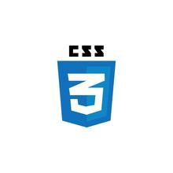

# CSS 

## Flexbox

> [CSS-TRICKS](https://css-tricks.com/snippets/css/a-guide-to-flexbox/)

> [MDN_FLEXBOX](https://developer.mozilla.org/fr/docs/Apprendre/CSS/CSS_layout/Flexbox)

### Exercice Flebox

> [FLEXBOX FROGGY](https://flexboxfroggy.com/#fr)

> [FLEXBOX DEFENSE](http://www.flexboxdefense.com/)

## Framework CSS

> 
- [Bootstrap](https://getbootstrap.com/)

> 
- [Bulma](https://bulma.io/)

> 
- [Foundation](https://get.foundation/)

>
- [Tailwind](https://tailwindcss.com/)

