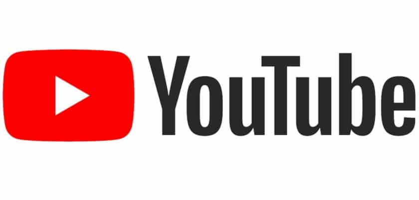

# 

## Les chaines youtube à suivre 
> [Traversy Media](https://www.youtube.com/channel/UC29ju8bIPH5as8OGnQzwJyA?feature=subscribe-embed&sub_confirmation=1)

> [Freecodecamp](https://www.youtube.com/channel/UC8butISFwT-Wl7EV0hUK0BQ)

> [Clever programmer](https://www.youtube.com/channel/UCqrILQNl5Ed9Dz6CGMyvMTQ)

> [Programming with Mosh](https://www.youtube.com/user/programmingwithmosh)

> [Telusko](https://www.youtube.com/channel/UC59K-uG2A5ogwIrHw4bmlEg)

> [Codewithharry](https://www.youtube.com/channel/UCeVMnSShP_Iviwkknt83cww)

> [CodeTutor](https://www.youtube.com/channel/UC3xHg20VI9mKFRaSs1yaicw)

> [Goobar](https://www.youtube.com/channel/UCVysWoMPvvHQMEJvRkslbAQ)

> [Smartherd](https://www.youtube.com/user/smartherd)

## Vidéos  

 >[Google Coding Interview With A College Student ➜](https://www.youtube.com/watch?v=3Q_oYDQ2whs)

>[Coding a YouTube Descriptions Updater [ Part 1 ] ➜ ](https://www.youtube.com/watch?v=uKmjvCPllWQ)

>[ Harvard CS50 ➜](https://www.youtube.com/redirect?v=bRwgTwCAqpQ&redir_token=QUFFLUhqa1pxbXNIY0Q3TXh5TWdHTzB3RWhaanFELUZkZ3xBQ3Jtc0tuZ1NqS05pSlFkMUtJVnB3VVgwaXlWczNfZ2JxSUF4b1I0N3V0elFyRkxVU1RBaGpzbXdBcXlySFJQeko4ZzBKWnVuNVlFWDloeVI1RDNXOFJ4ck95QVlsak9jMW5mT3hYSHhQcWlDai1TX19LREZTdw%3D%3D&event=video_description&q=https%3A%2F%2Fonline-learning.harvard.edu%2Fcourse%2Fcs50-introduction-computer-science)

